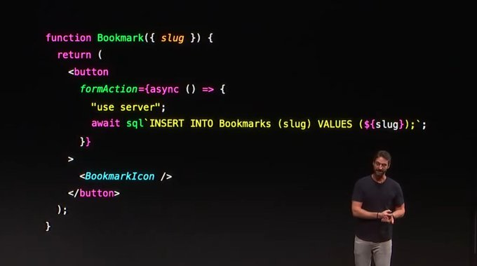

### 发布

- `Axios v1.6.0`，修复 CSRF 漏洞 CVE-2023-45857，修复查找函数装饰器以在 Node v20 中正常工作
- `Rspress v1.2.0`，新增 SSG 配置支持，修复锚点丢失问题...
- `Nutui v4.2.0`，新增 AvatarCropper 头像裁剪、Space 布局两个组件，修复 input-number 组件超过 min, max 范围问题...
- `tremor v3.10.0`，改进了轴刻度和 Switch 组件
- `jotai v2.5.0`，修复了一些错误，对于 jotai 效果至关重要，还添加了新的内部功能，有助于 jotai-scope 扩展

### 资讯

> Yarn 4.0 发布

有以下重大变化：

- Node.js 18+
- 默认情况下，使用 `yarn init` 创建的新项目将不再启用零安装
- 使用 `yarn init` 创建的新项目将使用 `Corepack` 而不是 `yarnPath`
- 现在默认包含所有官方插件（typescript、interactive-tools...）
- `yarn workspaces foreach` 命令语法有所变化

这次更新有个较大亮点是安装速度提升明显，相较于 3.6 版本在冷缓存安装 Gatsby 项目 350MiB 的依赖项性能提升 3 倍。

> Next.js 14

在 10.26 举行的 Next.js Conf 中宣布了 Next.js 14 版本，这个版本中有如下更新：

- Turbopack：App & Pages Router 通过 5000 项测试
  - 本地服务器启动速度提高 **`53%`**
  - 通过快速刷新，代码更新速度提高 **`94%`**
- 服务器操作（稳定）：渐进式增强的变更
  - 缓存和重新验证集成
  - 简单的函数调用，或者与表单原生兼容
- 部分预渲染（预览）：快速初始静态响应 + 流动的动态内容

升级到最新版本：

```bash
npx create-next-app@latest
```

一个有意思的点是在 `Server Actions` 特性中 支持写 sql。



> MDX 3

MDX 是一个支持在 Markdown 中写 JSX 的工具，在发布的 3 版本中限制了最低 Node.js 版本为 16，除此之外现在可以在 MDX 中使用 ES2024 现代 JS 语法。

---

资料：

- https://github.com/axios/axios/releases/tag/v1.6.0
- https://github.com/web-infra-dev/rspress/releases/tag/v1.2.0
- https://github.com/jdf2e/nutui/releases/tag/v4.2.0
- https://yarnpkg.com/blog/release/4.0
- https://nextjs.org/blog/next-14
- https://mdxjs.com/blog/v3/#breaking-changes
- https://github.com/pmndrs/jotai/releases/tag/v2.5.0
