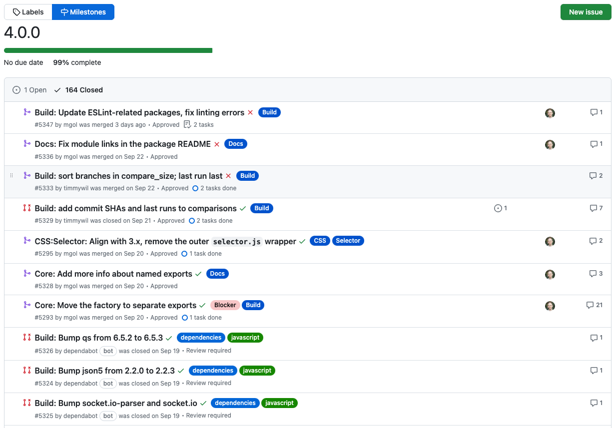

### 发布

- `Rspress v1.5.0`，升级 Rsbuild 依赖，新增默认支持 bash 语法高亮
- `Bun v1.0.9`，修复 Bun.spawn 错误、JSX transpiler 错误
- `NuxtUI v2.10.0`，新增 Divider、RadioGroup、Meter、Progress 组件，Table 组件新增 v-model:sort 属性
- `Docusaurus v3.0`，多个核心依赖升级，也添加了对 ES 模块和 TypeScript 配置文件的支持，包括站点配置、文档侧边栏、插件和预设
- `transformers.js v2.7.0`，新特性：文本转音频
- `arco-design-vue v2.53.0`，新增水印（watermark）组件，calendar 组件新增 header 和 default 插槽
- `electron v27.0.3`，修复在 macOS 中 dialog.showOpenDialog 修改文件格式错误问题

### 资讯

> Oh My Zsh

- `git pull --rebase` 别名 `gup` 已弃用，使用 `gpr`，凡是含有 `gup`xx 的别名全部废弃，全部调整为 `gpr`xx。如 `git pull --rebase origin $(git_main_branch)` 别名 `gupom` 调整为 `gprom`
- `web-search` 插件新增 `youtube` 搜索服务，`youtube next.js 14` 会在默认浏览器打开 youtube 并搜索 next.js 14
- `vsc` 快捷键用于在 vscode 中打开，现在新增参数可以指定打开的目录，如 `vsc xx/src` 用于在 vscode 中打开 xx 下的 src 目录

  ```zsh
  function vsc {
    if (( $# )); then
      $VSCODE $@
    else
      $VSCODE .
    fi
  }
  ```

> Deno 新特性

在发布的 1.38 版本 Deno 团队对 `deno doc` 命令做了改进，可使用 `deno doc --html` 生成静态站点文档。

除此之外还有如下更新：

- HMR 新的 `--unstable-hmr` 标志检测更改，重新加载服务器，同时保留状态，使用`deno run --unstable-hmr mod.ts`
- Node.js 兼容性改进，现在从 Node 迁移时，使用 Deno 会更加容易，可以使用所选择的 npm 包管理器，通过 npm 安装 npm 模块并使用 Deno 运行。
- 更快的 JSX 转换，使用字符串连接而不是对象分配，转换速度提升 7-20 倍
- `deno run --env`，内置支持 `.env` 文件
- WebSockets 改进，支持基于 HTTP/2 的 RFC8841 WebSocket
- `deno task` 支持 head 命令
- `REPL` 中支持使用 `Deno.test`
- 新增 `window.name` 和 `EventSource` Web API
- `std/http/server.ts` 废弃

> jQuery 4.0.0

前端开发的小伙伴多少都用过或听过 `jQuery`，前端领域的远古巨兽，在「构建」还未流行，网站开发基本使用 jQuery。


如今依旧在不断迭代中， 4.0.0 版本的开发进度已完成 99%，目前还无明确发布日期。在众多的改动中有个我比较关注的是 JS 压缩工具从 `Terser` 切换到 `SWC`。



---

资料：

- https://bun.sh/blog/bun-v1.0.9
- https://github.com/xenova/transformers.js/releases/tag/2.7.0
- https://github.com/nuxt/ui/releases/tag/v2.10.0
- https://github.com/web-infra-dev/rspress/releases/tag/v1.5.0
- https://github.com/electron/electron/releases/tag/v27.0.3
- https://docusaurus.io/blog/releases/3.0
- https://github.com/ohmyzsh/ohmyzsh
- https://deno.com/blog/v1.38
- https://github.com/jquery/jquery/milestone/7?closed=1
