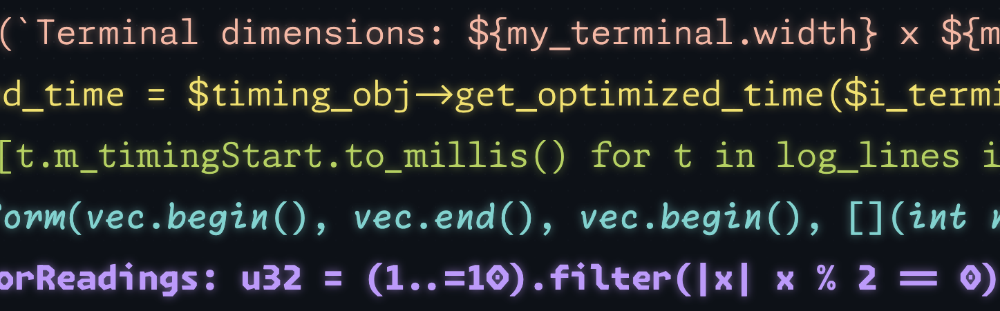

### 发布

- `rollup v4.4.0`，使用更快的内部 linting 替换 SWC linting 防止重复声明等错误
- `ant-design-vue v4.0.7`，新增 Flex 组件，水印支持暗黑模式
- `vueuse v10.6.0`，新增 useClipboardItems 方法，提供响应剪贴板命令（剪切、复制和粘贴）以及异步读取和写入系统剪贴板的能力
- `axios v1.6.1`，修复在非标准浏览器环境中 content-type 头部标准化问题
- `release-it v17`，不再支持 Node.js v16
- `commander.js v12 Prerelease`，要求 Node.js v18+，从 CommonJS 中删除了全局命令实例的默认导出（改为使用命名 program 导出）
- `Bun v1.0.11`，新增内置 Bun.semver 方法，相比 node-semver 快 20x 倍

### 资讯

> Angular 17

在 v17 中主要变化如下：

- 可延迟视图将性能和开发人员体验提升到一个新的水平
- 在公共基准测试中，通过内置控制流循环，运行时间提高了 90%
- 混合渲染的构建速度提高了 87%，客户端渲染的构建速度提高了 67%
- 新生命周期钩子 `afterRender`、`afterNextRender`
- 新项目默认使用 Vite 和 esbuild
- ...

> GPT-4 Turbo

OpenAI 于 3 月发布了 GPT-3.5 Turbo，在 OpenAI 首届开发者大会上，宣布推出 GPT-4 Turbo，这款模型正处于预览状态，号称对于开发者而言 “比上代 GPT-4 更强大，便宜三倍”。

知识覆盖到 2023 年 4 月的世界事件，拥有 128k 的上下文窗口，能够处理相当于 300 多页文本的内容，性能得到优化，价格降低，输入令牌价格降低 3 倍，输出令牌价格降低 2 倍。新增视觉功能，集成了 DALL・E 3，新增了文本到语音转换功能。

> Monaspace 字体家族

根据官方介绍，Monaspace 是一种新型系统，它提高了屏幕上代码显示的技术水平。等宽字体通常彼此不兼容。每个字体都使用不同的度量，因此不可能混合不同的字体。每种 Monaspace 字体都经过精心设计，可以无缝混合和匹配。通过超越颜色和更大胆的权重的调色板，为代码赋予更多含义，为需要更多结构和层次结构的代码构建接口。

---

资料：

- https://github.com/rollup/rollup/releases/tag/v4.4.0
- https://github.com/vueComponent/ant-design-vue/releases/tag/4.0.7
- https://github.com/vueuse/vueuse/releases/tag/v10.6.0
- https://github.com/axios/axios/releases/tag/v1.6.1
- https://github.com/release-it/release-it/releases/tag/17.0.0
- https://github.com/tj/commander.js/releases/tag/v12.0.0-0
- https://bun.sh/blog/bun-v1.0.11
- https://blog.angular.io/introducing-angular-v17-4d7033312e4b
- https://openai.com/blog/new-models-and-developer-products-announced-at-devday
- https://monaspace.githubnext.com/
