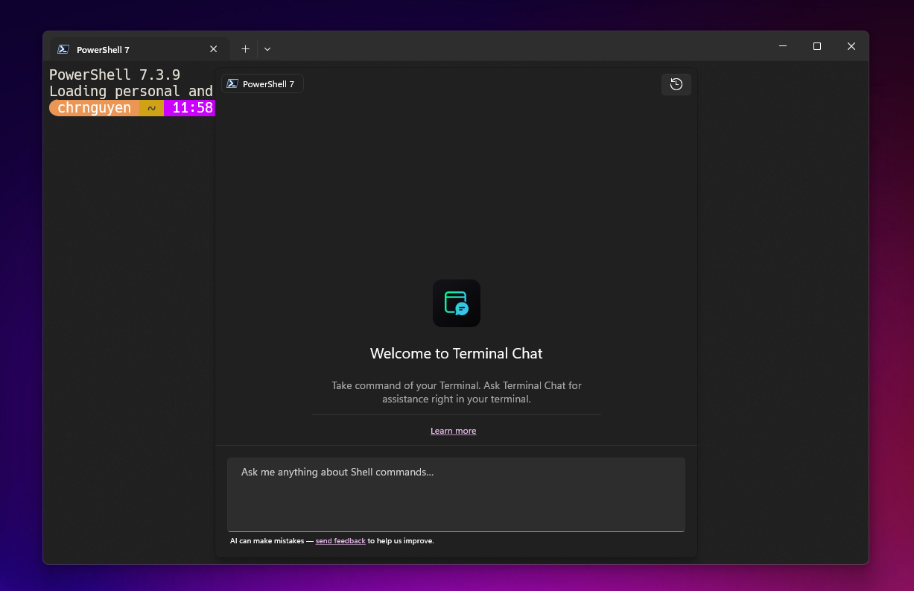
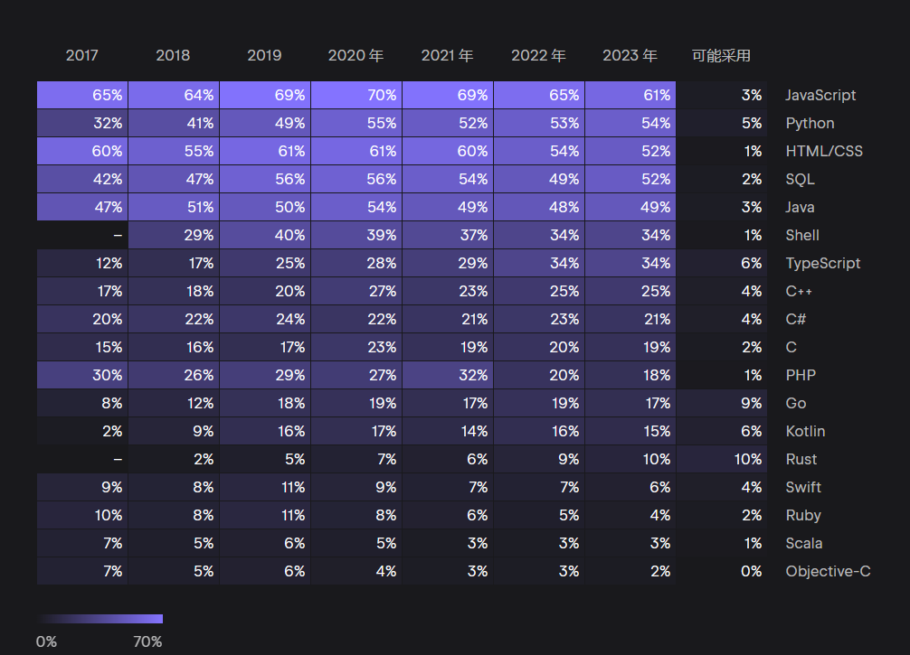

### 发布

- `Lerna v8`，不再支持 Node.js 16，`learn run` 命令依赖 nx v17 不再是 16
- `NuxtUI v2.11`，新增 Breadcrumb、Chip 组件，Icon 组件新增 dynamic 属性，有助于图标使用动态类名
- `Nitro v2.8`，零配置部署 AWS，升级到 Rollup 4，支持基于 SWC 的原生解析器实现更快的构建
- `Bun v1.0.14`，新增 BUN.GLOB，一种快速的 API，用于使用 Glob 模式匹配文件和字符串
- `openai-node v4.20`，允许直接从 Github 安装包

### 资讯

> Windows Terminal Chat

微软在 Windows Terminal Canary 版本中发布 Terminal Chat。

Windows 终端用户将能够利用自然语言 AI 在 Windows 终端中获得智能建议，但它自身并无大语言模型，终端聊天目前仅支持 Azure OpenAI 服务，要获取 Azure OpenAI 服务终结点和密钥，需要创建并部署 Azure OpenAI 服务资源才可聊天。

> JetBrains 2023 开发者报告

来自全球 26348 位开发者，涵盖广泛的主题，包括编程语言、工具和技术，以及受众特征和有趣的事实，今年还调查了 AI 的应用。

过去三年，JavaScript 的份额一直在下降，Rust 是今年唯一创下受欢迎程度新纪录的常用语言。Rust 立志以其严格的安全性和内存所有权机制取代 C++，最初可能会击败 Go，因为六分之一的 Go 用户在考虑采用 Rust。Rust 与 Scala 一样，是最少程序员想要迁出的语言。

在薪资趋势上，Scala、Go 和 Kotlin 位列前三。

AI 使用上，77% 的开发者使用 ChatGPT 聊天助手，46% 的开发者使用 GitHub Copilot 编程助手，开发者使用 AI 助手的最常见方式是使用自然语言询问开发相关问题。

> Rspack 0.4 发布

- Rsbuild 是基于 Rspack 的构建工具，发布 0.1 版本
- `Rsbuild Doctor` 构建分析工具，提供可视化 UI，用于所有 Rspack 和 Webpack 项目
- 使用新的解析器 `oxc_resolver`，该解析器使用 Rust 编写，有更快的解析速度
- 废弃 `builtin.react.refresh`，使用 `@rspack/plugin-react-refresh`启用 React Fast Refresh
- 废弃 `builtin:sass-loader`，使用 `sass-loader`
- 需要 Node.js 16+

---

资料：

- https://github.com/lerna/lerna/releases/tag/v8.0.0
- https://github.com/nuxt/ui/releases/tag/v2.11.0
- https://github.com/unjs/nitro/releases/tag/v2.8.0
- https://bun.sh/blog/bun-v1.0.14
- https://devblogs.microsoft.com/commandline/terminal-chat-in-windows-terminal-canary
- https://www.jetbrains.com/zh-cn/lp/devecosystem-2023
- https://www.rspack.dev/zh/blog/announcing-0.4.html
