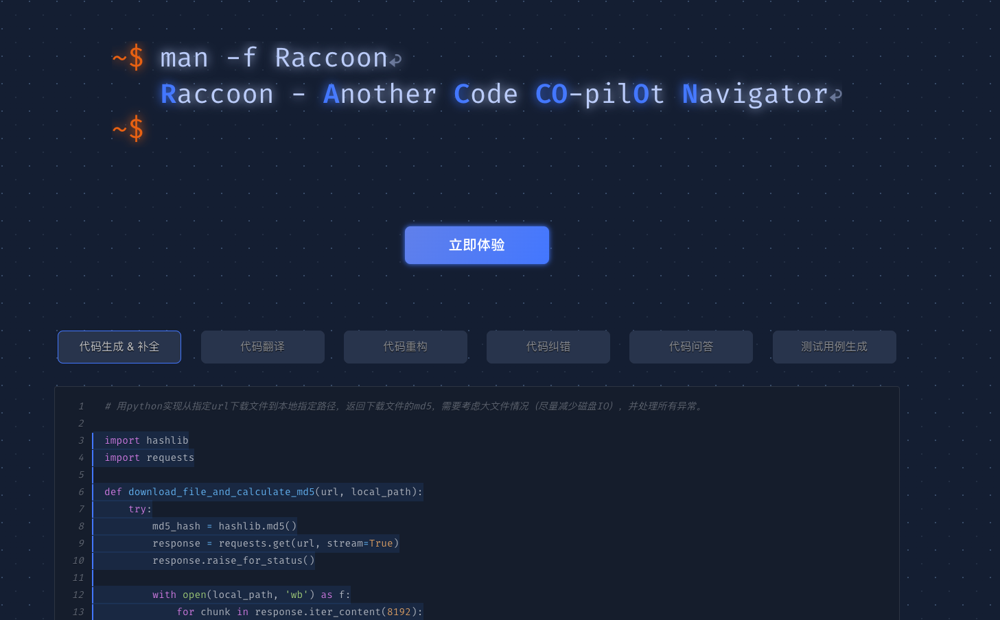
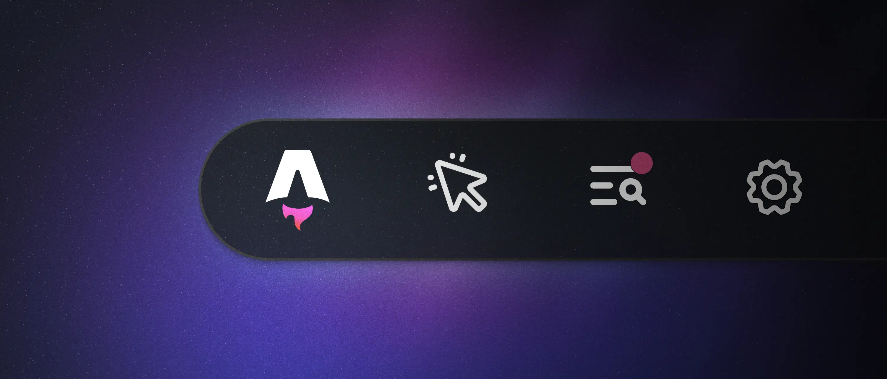

### 发布

- `React Native v0.73`，对 Android 14 支持，Kotlin 现在是使用 React Native 构建的 Android 应用程序的推荐语言
- `Redux v5`，ESM/CJS 包兼容，移除构建 UMD 版本，createStore 正式弃用
- `create-vue v3.9.0`，升级依赖 Vite 5、Vitest 1，改进了类型检查可以捕获更多错误，对于 JS 项目添加 jsconfig.json
- `TW-Elements v1.1.0`，新增 Autocomplete、Multi Range Slider 组件，更新了 SvelteKit 和 Bun 的集成
- `qwik v1.3.0`，Vite 5 支持，现在 Signal 支持 JSX
- `cz-git v1.8.0`，defaultScope 支持 string[] 来默认选择复选框模式
- `AVA v6`，watcher 被重写，现在以递归模式构建在 fs.watch() 上，不再支持 Node.js 14、16

### 资讯

> Windows 10 EOS

微软官方于 12 月 5 日发文表示 Windows 10 将于 2025 年 10 月 14 日终止支持 (EOS)，还表示 Windows 11 是迄今为止最安全的 Windows。

终止支持意味着：将不再提供问题的错误修复、漏洞的安全修复、时区更新或可能发生的问题的技术支持。

> 代码小浣熊

商汤发布 AI 编程助手：代码小浣熊 Raccoon，目前已支持 Python、Java、JavaScript、C++、Go、SQL 等 30+ 主流编程语言和 VS Code、IntelliJ IDEA 等主流 IDE。

跟其他 AI 编程工具一样具有：代码自动补全、重构、纠错、问答等特性。可跳转 https://code.sensetime.com 了解更多

> Astro 4.0

在 12 月 5 日，Astro 发布 4.0 版本，可以跳转 `https://astro.new` 尝鲜。此次版本有以下亮点：

- Astro 开发工具栏
- 国际化 (i18n) 路由
- 增量内容缓存（实验阶段）
- 新的视图转换 API
- 重新设计的日志记录
- 重新设计的文档

引入了开发工具栏，增强和定制在本地浏览器中使用 Astro 的开发体验，可以检查页面、捕捉棘手的无障碍问题，并使用自定义应用和第三方工具来扩展工具栏功能，仅在开发过程中出现在浏览器中，不会出现在最终的生产构建中。

> Electron 28.0

Electron 发布最新版本 v28，有以下特性：

内核模块升级：

- Chromium `120.0.6099.56`
- Node `18.18.2`
- V8 `12.0`

还有一些破坏性的改动需要注意：

1. 有以下方法或事件已经被移除：

   - `BrowserWindow.getTrafficLightPosition()`
   - `BrowserWindow.setTrafficLightPosition()`
   - `app.runningUnderRosettaTranslation()`
   - `ipcRenderer.sendTo()`
   - `scroll-touch-{begin,end,edge}`

2. 将 `backgroundThrotdling` 设置为 `false` 将禁用 BrowserWindow 中显示的所有 WebContent 的帧限制。

新特性：

- 开启 ESM 支持
- `UtilityProcess` API 现在支持 ESM 入口点
- `display` 对象添加 `detected`、`maximumCursorSize`、`nativeOrigin` 属性
- 添加了对 Linux 上的 `ELECTRON_OZONE_PLATFORM_HINT` 环境变量的支持

---

资料：

- https://github.com/mdbootstrap/TW-Elements/releases/tag/v1.1.0
- https://github.com/vuejs/create-vue/releases/tag/v3.9.0
- https://github.com/BuilderIO/qwik/releases/tag/v1.3.0
- https://reactnative.dev/blog/2023/12/06/0.73-debugging-improvements-stable-symlinks
- https://github.com/avajs/ava/releases/tag/v6.0.0
- https://astro.build/blog/astro-4
- https://releases.electronjs.org/release/v28.0.0
- https://techcommunity.microsoft.com/t5/windows-it-pro-blog/plan-for-windows-10-eos-with-windows-11-windows-365-and-esu/ba-p/4000414
- https://code.sensetime.com
