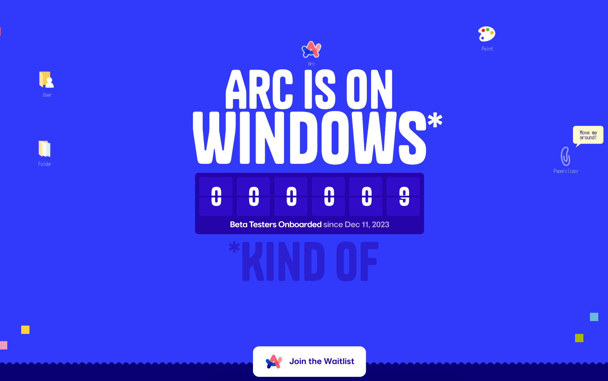

### 发布

- `Deno v1.39`，WebGPU 回归、新的 Deno 覆盖率报告器、Node.js 兼容性提升、 Deno 和 Web API 更新、编译增强...
- `Million v3.0`，是一个编译器，可将现有的 React 代码转换为超优化的虚拟 DOM。3.0 版本实现更快的构建时间、更快的运行时
- `SvelteKit v2.0`，增加了对 Vite 5 的支持，新的 Svelte DevTools、Svelte Inspector 和实验图像优化支持，为 2024 年发布的 Svelte 5 做准备
- `Bun v1.0.17`，速度提升，bunx supabase 比 npx supabase 快 30 倍，bunx esbuild 比 npx esbuild 更是提升 50 倍
- `arco-design-vue v2.54`，新增 verification-code 验证码组件

### 资讯

> Deno 1.39：WebGPU 回归

Deno 于 2021 年初首次引入了 WebGPU，但由于性能问题在今年早些时候被删除。在此版本中，重新引入它并解决了所有性能问题。

Deno 1.39 标志着 Deno 生态系统的重大更新，其中备受期待的 WebGPU 回归，增强了图形、游戏和机器学习的功能。我们还引入了新的 Deno 覆盖率报告器，以改进代码库分析，并在 Node.js 兼容性方面取得了重大进展，从而简化了 Node.js 开发人员的过渡。最后，此版本包括标准库更新、性能优化和最新的 TypeScript 5.3 支持。

如果已安装 Deno，执行以下命令更新：

```shell
deno upgrade
```

WebGPU API 为开发人员提供了一种低级别、高性能、跨架构的方式来通过 JavaScript 对 GPU 硬件进行编程。它是 Web 上 WebGL 的有效继承者，该规范已经最终确定，Chrome 也已经发布了 API，Firefox 和 Safari 正在提供支持。

> Vue2 EOL

12 月 15 日，Evan You 宣布 Vue 2 将于 12 月 31 日进入 `EOL` 阶段（生命周期结束）。

距离 Vue2.0 于 2016 年发布至今已有 7 年多时间，是 Vue 成为主流框架历程中的一个重要里程碑，随着 Vue 3 及其生态系统的成熟，团队将精力集中在最新的主要版本上。

进入 EOL 阶段意味着不再有新特性，更新，Bug 修复的发布，仍然可继续使用，但会收到弃用警告，提醒您 Vue 2 不再是受支持的版本。

> Arc for Windows

Arc 浏览器于几个月前发布 1.0 正式版，但 PC 上仅仅支持 macOS，并不支持 Windows。就在 12 月 11 日，Arc 浏览器 Windows 测试版开启。

Arc 同 Chrome 一样基于 Chromium 内核，它使用 Swift 开发，界面干净整洁，功能丰富，支持多个独立工作区，整体使用体验不错，Windows 用户感兴趣可以跳转 https://www.isarconwindowsyet.com 点击加入到等待队列。



> Oxlint 全面上市

12 月 12 日 `Oxlint` 被宣布全面上市，这是一个 `JavaScript linter`，旨在捕获错误或无用的代码，默认情况下不需要任何配置。在文档中宣称比 ESLint 快 50-100 倍，性能提升源于 Oxlint 专门针对性能而设计，利用 Rust 和并行处理作为关键因素。

Oxlint 默认识别错误、冗余或令人困惑的代码——优先考虑正确性，而不是不必要的挑剔规则。目前并无插件系统，团队在成整合前端流行工具插件规则。

---

资料：

- https://bun.sh/blog/bun-v1.0.17
- https://million.dev/blog/million-3
- https://svelte.dev/blog/sveltekit-2
- https://deno.com/blog/v1.39
- https://blog.vuejs.org/posts/vue-2-eol
- https://www.isarconwindowsyet.com
- https://oxc-project.github.io/blog/2023-12-12-announcing-oxlint.html
- https://github.com/arco-design/arco-design-vue/releases/tag/2.54.0
