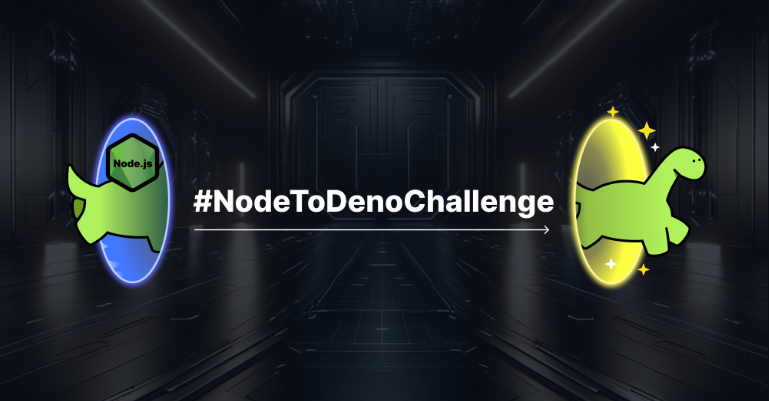
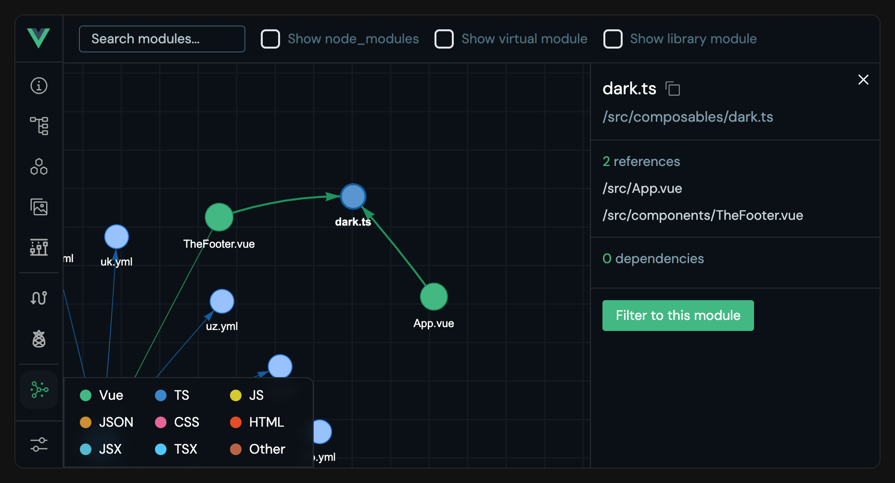
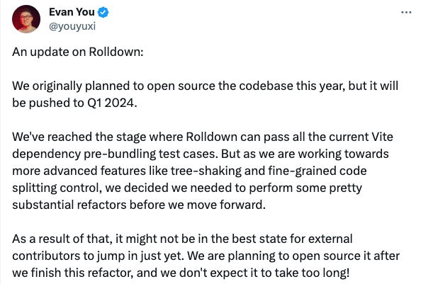
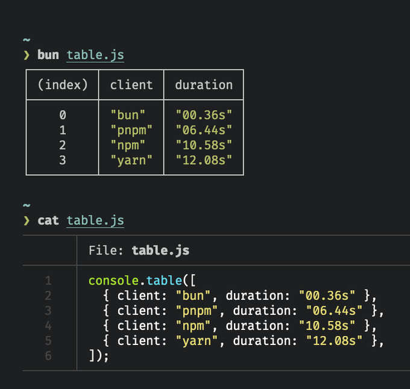

### 发布

- `StyleX v0.4.1`，编译产物体积进一步减小、为 Rollup 插件添加了 Flow 和 TypeScript 类型、打包跳过不包含 StyleX 的文件缩短构建时间
- `Bun v1.0.20`，修复 setTimeout 在 Linux 上导致 CPU 使用率过高的问题，fs.readlink、fs.readFile、fs.writeFile 内存占用降低
- `arco-design v2.58`，新增 ColorPicker 组件

### 资讯

> NodeToDenoChallenge

2023 年 Deno 最大的举措之一是提高 Node 和 npm 的兼容性，在 Deno 1.28 中引入 `npm:` 说明符以来，通过 `node:` 说明符添加了对 Node 模块的内置支持。

近日 Deno 团队为了鼓励每个人在他们的 Node 项目中尝试 Deno，启动了 `NodeToDenoChallenge`。

挑战说明：

截止到 1 月 4 日，在任何 Node 项目中运行 Deno，对输出进行屏幕截图（成功或失败），并使用主题标签 #NodeToDenoChallenge 发布推文或发布到 GitHub issues 上，将随机挑选 10 名参与者和尝试在最大的 Node 项目上按代码行运行 Deno 的个人，并奖励 100 美元的 Deno 商品商店礼品卡。

> Vue DevTool

适用于 Vue 3 的新一代 Vue DevTool 开源了。旨在增强 Vue 开发人员体验的工具，它提供了一些功能来帮助您更好地了解您的 Vue 应用程序。目前可通过 Vite Plugin 使用，Chrome 拓展还在开发当中。

具有的特性：

- 显示应用程序的快速概述，包括 Vue 版本、页面和组件
- 页面栏显示您当前的路线以及一些有用的信息，并提供在页面之间导航的快速方法。您还可以使用文本框查看每条路线的匹配情况
- 组件栏显示您的组件信息，包括节点树、状态等。并提供一些交互功能
- 静态资源栏显示项目目录中的文件
- 时间轴栏允许您浏览状态或事件的先前版本
- Router 栏是与 vue-router 集成的功能，查看路由列表及其详细信息
- Pinia 栏是与 pinia 集成的功能，查看商店列表及其详细信息，并编辑状态
- Inspect 公开了 vite-plugin-inspect 集成，允许检查 Vite 的转换步骤
- Graph 栏显示模块之间的关系

> Rolldown 2024 年开源

近日 Evan You 更新了 Rolldown 的开发情况，他说：原本计划今年开源代码库，将推迟到 2024 年第一季度。Rolldown 目前通过当前所有 Vite 依赖预捆绑测试用例的阶段。但是，当我们致力于实现更高级的功能（例如树摇动和细粒度代码分割控制）时，我们决定在继续前进之前需要执行一些相当大的重构，计划在完成这次重构后将其开源，我们预计不会花太长时间。

> Bun 即将支持 console.table()

Bun 将在下一个版本支持 `console.table()`

> Vue 3.4

继不久前 Vue 2.7.16 "Swan Song"（绝唱）发布后，12 月 28 日迎来 Vue 3.4 "Slam Dunk"（灌篮高手） 发布，此版本包括一些重大改进。最值得注意的是重写的模板解析器速度提高了 2 倍，重构的响应式系统使效果触发更加准确和高效。

删除了已废弃特性：

1. 不再注册全局 `JSX` 命名空间，避免与 React 的全局命名空间冲突，以便两个库的 TSX 可以在同一项目中共存
2. 响应式转换现在推荐使用 `Vue Macros plugin`
3. `@vnodexxx` 事件模版监听器现在是编译错误，使用 `@vue:XXX`
4. `v-is` 指令已删除，使用 `

` 语法
5. `app.config.unwrapInjectedRef` 已删除

`defineModel` 在这个版本已经稳定，为 v-model 提供更好的支持。

关于 `v-bind` 的更新：

绑定属性如果同名则可以简写，`` 可简写为 ``。

> Nuxt 3.9

支持 Vite 5 和 Rollup 4 并且基于最新 Vue 3.4。有以下几大变化：

- 交互式服务器组件，`nuxt-client` 指令指定要进行水合的组件
- 自动服务器优化，现在使用 Vite 的新 AST-aware 定义对服务器端代码执行更准确的替换
- 现在为 <NuxtLoadingIndicator> 提供了一个新的基于 Hook 的系统，包括一个 useLoadingIndicator 可组合项，可控制/停止/启动加载状态
- 在 `callOnce` 中运行单个事件，代码可以可只运行一次，无论页面加载多少次。但注意必须在组件设置函数或 Nuxt 插件中调用

> GitHub Copilot Chat

GitHub Copilot Chat 现在普遍可供组织和个人使用，所有 GitHub Copilot 用户现在都可以通过 Copilot Chat 享受自然语言支持的编码，无需额外付费。现已普遍适用于 Visual Studio Code，经过验证的教师、学生和流行开源项目的维护人员也可以免费使用。

---

资料：

- https://stylexjs.com/blog/v0.4.1
- https://bun.sh/blog/bun-v1.0.20
- https://github.com/arco-design/arco-design/releases/tag/2.58.0
- https://blog.vuejs.org/posts/vue-3-4
- https://nuxt.com/blog/v3-9
- https://devtools-next.vuejs.org
