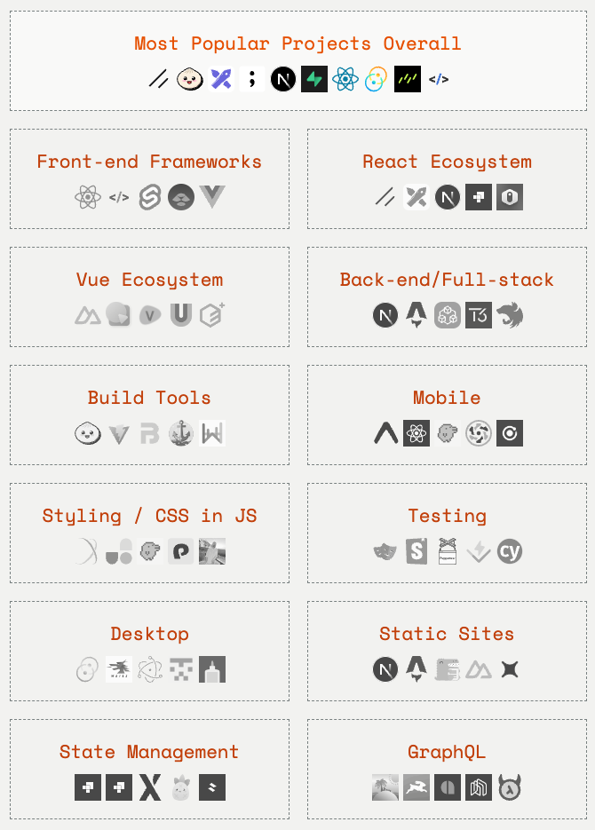
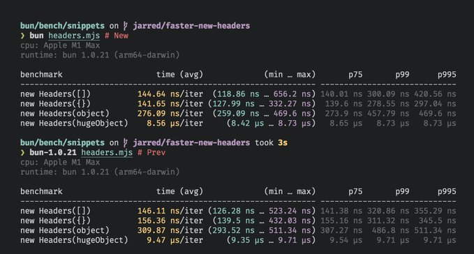

### 发布

- `Bun v1.0.21`，支持 console.table()、Bun.write、Bun.file 和 Bun:sqlite 占用更少内存、Node.js 兼容性改进
- `Astro v4.1`，新的可访问性审核规则、client:visible 指令接收 rootMargin 选项、自定义 cookie 编码解码
- `ant-design-vue v4.1`，适配 Vue 3.4 修复 Modal 组件销毁问题

### 资讯

> 2023 JavaScript Rising Stars

`shadcn/ui` 登顶成为 2023 年最热门项目。它使用 React 编写的 UI 组件的集合，允许通过 TailwindCSS 进行自定义样式，建立在 Radix 之上，是一组 headless 组件。

`Bun` 作为去年的冠军项目今年势头依旧很猛，于 2023 年 9 月份 Bun 正式迎来 1.0 版本。2023 年是 Bun 高速发展的一年，与 Node.js 生态有良好兼容性，目标是在 2024 年将默认的 JS 运行时从 Node.js 切换到 Bun。

`React`虽然已经一年多没有发布新版本，但依旧坐稳 JavaScript 框架首位。其生态系统也是不断有新工具出现，如 `Excalidraw`，是一个用于绘制手绘图的虚拟白板，作为后起之秀也是一举拿下年度最受欢迎项目第三名。

随着 Vite 近几年的高速发展，`Webpack`、`Create React App`一些工具逐渐慢慢淡出大众开发者视线，今年已经消失在榜单排行。

今年的新角色 `Rspack` 超越 esbuild、SWC 成为最热门构建工具排名第五，大有可期。

`Tauri` 同 2022 年一样断崖式领先依旧是最热门客户端开发工具。

个人看法，今年的前端圈发展不再像几年前一样爆炸性新工具层出不穷，在逐渐放缓脚步，更多的焦点是集中在性能上面，打造更快、占用更低的工具。

> 2023 Warp 最喜爱的功能

1. Warp AI：集成的人工智能助手现在生活在 Warp 中！借助 Warp AI，可以收到有关在调试和编码时下一步运行什么命令的分步指导
2. Vim Keybindings：可以在 Warp 中使用 Vim 键绑定编辑命令，在命令面板中启用此功能
3. Markdown Viewer：借助 Warp 的新 Markdown 查看器，文件中的所有命令都将呈现为交互式代码块，单击命令将直接在终端中执行
4. Warp Prompt Builder：可自定义提示以添加您选择的相关元数据：目录、Git 分支、Kube 上下文、日期、时间等。而且也支持 p10K
5. Create Theme From Image：通过上传图像来生成自定义主题

> TinyEngine 服务端开源

`TinyEngine` 是一个适用于多场景的低代码平台开发，包括资源编排、流程编排、服务端渲染、模型驱动、移动端、大屏端以及页面编排等。为了帮助开发者打通低代码平台搭建的前后端整体流程，开源服务端配套代码，为自由定制和拓展提供可能。服务端设计基于 Node.js，采用 Egg.js 作为业务接口微服务的框架。

> NodeToDenoChallenge 结果出炉

总共收到了 47 份提交内容，其中包括 node-cbor 和 node-gamedig 等实用程序库、create-react-app 和 create-vite 等脚手架和构建工具、VSCode 扩展管理器、个人网站、应用程序和机器人等。

提交的最大 Node 项目（按 JavaScript/TypeScript 行数）是 `kibana`，有 3,212,395 行代码。提交的内容还包括他们尝试的分步演练，例如修改 require 语句、启用的 Deno 标志集以及删除一些 Node 版本验证。

> new Headers 速度提高 10%

Bun 下个版本，new Headers (myObject) 速度提高 10%。

---

资料：

- https://bun.sh/blog/bun-v1.0.21
- https://astro.build/blog/astro-410
- https://risingstars.js.org/2023
- https://www.warp.dev/blog/12-favorite-features-warp-shipped-in-2023
- https://deno.com/blog/node-to-deno-challenge#results
