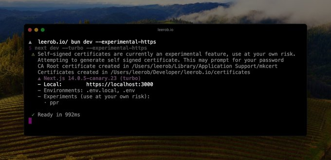
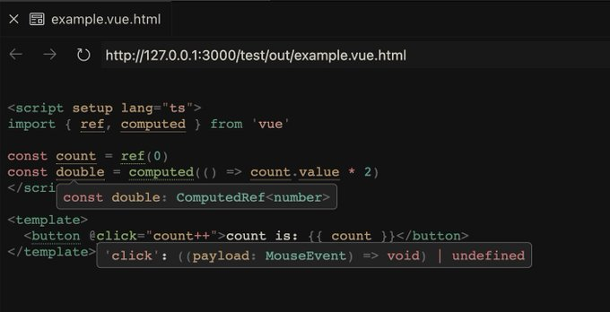

### 发布

- `Rspack v0.5`，支持模块联邦，比 Webpack 模块联邦更快、移除已弃用的内置选项如 builtins.html、builtins.minifyOptions 等、移除 builtin:sass-loader...
- `LangChain v0.1`，从 langchain 中分离出 langchain-core、分离 partner 包进入 langchain-community 或独立 partner 包
- `Bun v1.0.22`，修复在 Vercel 上的安装问题、添加了 Performance.mark() API 以及对额外管道的 child_process 支持
- `Nuxt UI v2.12`，新增 InputMenu 组件显示带有实时建议的自动完成输入、Form 组件暴露 submit 方法
- `tdesign-vue-next v1.8`，新增 Descriptions 描述组件、DatePicker 组件国际化切换无效问题修复
- `tdesign-react v1.5`，新增 Descriptions 描述组件、Dialog 添加了 dialogClassName 用于处理内部 dialog 节点样式

### 资讯

> GPT Store

OpenAI 开始向 ChatGPT Plus、团队和企业用户推出 GPT Store。GPT 商店包含 OpenAI 合作伙伴以及社区开发的各种 GPT，浏览社区排行榜上流行和趋势的 GPT，类别包括 DALL·E、写作、研究、编程、教育和生活方式。而且将在第一季度启动 GPT 构建者收入计划，用户对其 GPT 的参与度获得报酬。

每周都有新的特色 GPT，首批推出的一些 GPT 包括：

1. `AllTrails` 个性化路线推荐
2. `Consensus` 搜索并综合 2 亿篇学术论文的结果
3. `Code Tutor` 扩展编码技能
4. `Canva` 设计演示文稿或社交帖子
5. `Books` 通过书籍查找下一本读物
6. `CK-12 Flexi` 随时随地学习数学和科学

> import.meta.dirname

在最新发布的 Node.js 20.11.0 中新增了`import.meta.dirname`和`import.meta.filename`，这两个 API 目前都处于 Stability: 1.2 阶段，代表功能稳定，预计不会有进一步重大更改。

想要使用`__dirname`和`__filename`获取目录和文件名时，只能在 CJS 中，现在终于可以在 ESM 中使用`import.meta.dirname`和`import.meta.filename`直接获取了。

> Next.js 本地开发的 HTTPS

对于某些用例，例如 Webhooks 或身份验证，可能需要使用 HTTPS 在 localhost 上具有安全的环境，Next.js 可以生成一个自签名证书。

还可以使用`--experimental-https-key`和`--experimental-https-cert`提供自定义证书和密钥。或者使用`--experimental-https-ca`提供自定义 CA 证书。

执行`next dev --experimental-https`可在本地使用 HTTPS 运行。

> TwoSlash for Vue SFC

Vue SFC 的`TwoSlash`即将推出，作用是将文档代码片段添加 jsdoc 提供类型信息，以帮助开发者更好地理解代码，很类似 TypeScript 文档中对代码的注解。

> Nuxt Bridge v3

近日 Nuxt 团队发布了 Bridge v3，以帮助将老项目迁移到 Nuxt 3。它是一个前向兼容，只需安装并启用 Nuxt 模块即可体验许多新的 Nuxt 3 功能，零配置、使用 vite、nitro、unhead。

> Hono 10k star

Hono 是一个轻量、简单且超快的 Web 框架，适用于`Deno` `Bun` `Vercel` `Netlify` `Node.js` `Cloudflare Workers`等众多 JavaScript 运行时。昨日 Hono 在 Github 上 star 数达成 10k 成就。

---

资料：

- https://www.rspack.dev/zh/blog/announcing-0.5
- https://blog.langchain.dev/langchain-v0-1-0
- https://bun.sh/blog/bun-v1.0.22
- https://github.com/nuxt/ui/releases/tag/v2.12.0
- https://nodejs.org/docs/latest/api/esm.html#importmetadirname
- https://openai.com/blog/introducing-the-gpt-store
