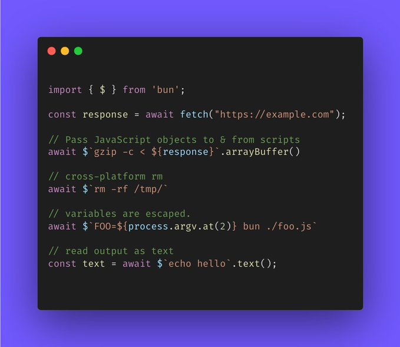
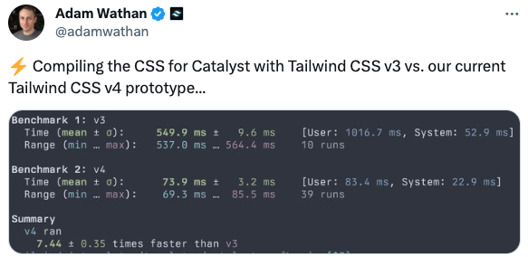

### 发布

- `Next.js v14.1`
  - Turbopack 改进，通过整个 Next.js 开发测试套件，初始编译时间和快速刷新更快
  - next/image 现在可通过 getImageProps 支持更高级的用例，包括 background-image、canvas、<picture>
  - Parallel 和 Intercepted Routes 改进
  - 开发体验的优化，对于报错信息更加直观明确，会显示错误的源代码和受影响的文件
- `Angular v17.1`
  - 支持 TypeScript 5.3
  - Signal inputs
  - 现有项目可选择迁移到 esbuild
- `Bun v1.0.24`，新增 Bun Shell，一个跨平台的 shell 语言和解释器，用于使用 JavaScript 编写 shell 脚本
- `lightningcss v1.23.0`，优化 @layer 和 @property 规则，写法上更加简洁

### 资讯

> Bun Shell

前些天 Jarred Sumner（Bun 作者）发文`import { $ } from 'bun'`猜这会是什么？有人笑着说到 Bun 终于支持 JQuery。现在`$`的含义揭晓，即`Bun Shell`，跨平台 shell 语言和解释器，用于使用 JavaScript 编写 shell 脚本，语法上类似`zx`。

由于某些命令在 Windows 上无法正常工作，社区出现了一些三方工具对系统兼容性做弥补，如`rimraf`、`cross-env`等。为了能抹平不同系统带来的差异性更好的使用 JavaScript 编写脚本，Bun Shell 应运而生。

不仅如此，还可以作为 shell 解释器`bun xxx.sh`。目前最新 Bun v1.0.24 版本内置了 Bun Shell 开箱即用。

> QAnything 开源

网易有道自研的知识库问答引擎 QAnything 正式开源，基于检索增强的生成（Retrieval Augmented Generation，简称 RAG），能够利用检索外部内容的方式增强大语言模型的准确度、专业能力和个性化等各方面的性能。

可以部署到本地，支持 word、ppt、excel、pdf、图片等多种文档格式，直接导入进去即可像 ChatGPT 一样问答，目标是万物皆可问。

> Deno Survey

deno 团队发起一份简短调查，目的是改善 deno。调查链接：https://deno.co/survey2024，感兴趣的小伙伴可以参与。

> 在 Android 上支持 WebGPU

Chrome 团队宣布，在搭载 Android 12 及更高版本并由 Qualcomm GPU 和 ARM GPU 提供支持的设备上，Chrome 121 现在会默认启用 WebGPU，未来会对 Android 11 设备做支持。

有了 WebGPU 支持，手机端也可以实现更多复杂图形场景需求。

> TailwindCSS v4

TailwindCSS 创建者发文表示为 Catalyst 编译 CSS，TailwindCSS v4 相较于 v3 速度大幅度提升。目前还处于 v3.4 版本，静等 v4 的发布。

---

资料：

- https://nextjs.org/blog/next-14-1
- https://bun.sh/blog/bun-v1.0.24
- https://mp.weixin.qq.com/s/kFOqYqhpy0Q4OvvGul-3qA
