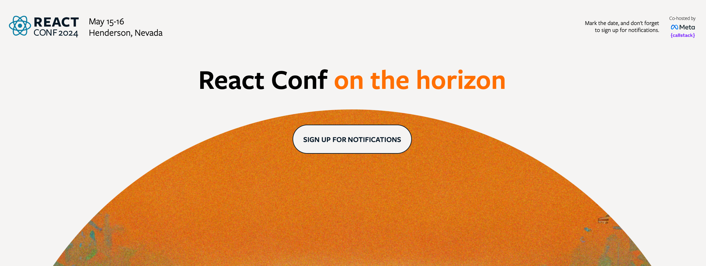
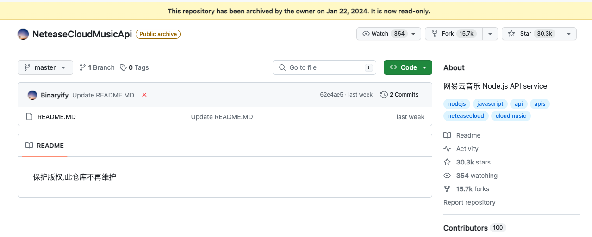

### 发布

- `Deno v1.40`
  - 引入 Temporal API 用于高级日期和时间操作
  - 支持 import.meta.filename 和 import.meta.dirname
  - 支持 TC39 第三阶段 Decorators 提案
  - API 新增 Deprecations、stabilizations、removals 标记，其中已弃用的 API 有 Deno.run()、Deno.serveHttp()等
  - 支持 rejectionhandled Web API，被 catch 到就会触发该事件
  - 一系列 Node API 可用，如 fs.contants、fs.cp()、process.abort()等
- `Shikiji v0.10`
  - 从 @typescript/twoslash 迁移到 TwoSlash 包获得更好的组合性和性能
  - 进行了相当多的改进，包括更丰富的渲染结果、更强大的接口，甚至可选的 Vue SFC 支持
  - 移除了 getShikiContext API
  - 弃用并禁用 highlightLines 选项
  - vitepress-twoslash 支持渲染 jsdoc 标签
- `AdonisJS v6`，代码迁移到 ESM 规范，为能使用其他更快的编译工具，不再依赖 TS 编译 Hook
- `Mantine v7.5`，新增 DonutChart、PieChart 组件
- `Rspress v1.11`，手机设备上支持 TOC
- `TypeORM v0.3.20`，添加对 oracle 的 json 类型支持

### 资讯

> Bun for Windows

在最新发布的 v1.0.25 中已透露，Bun 的 Windows 版本将于 10 天后发布，大概 2 月初就能在 Windows 上使用 Bun，目前通过了 Bun 测试套件的 69.42%。

> React Conf 2024

React Conf 回归，将于今年 5 月份举办，会议内容包括 React 团队发布的一些激动人心的公告，可以期待一下。

> Rsdoctor

近日 Rsdoctor 开源并发布 v0.1 版本。根据介绍，`Rsdoctor`是一个面向构建过程与构建产物提供诊断和分析的工具，支持 Webpack 及 Rspack 构建分析，展示编译耗时及编译行为细节。具有编译可视化、构建产物构建时分析能力、支持自定义规则等特性。

> Zed

由 Atom 团队打造的一款基于 Rust 开发的编辑器，但目前仅提供 macOS 版，其他系统还尚未支持。

根据官方给出的介绍，Zed 具有高性能，在启动时间、文件加载速度要快于 VScode 以及其他编辑器，内存占用极低仅次于 Sublime。

体验了一下很简洁，暂时没看到插件系统，下载地址：https://zed.dev

> OH My Zsh

最新版本中`web-search`插件添加了`deepL`搜索服务，`vscode`插件添加`vscp`别名，作用是使用 vscode 指定配置文件打开代码，用法如下：`vscp profile`。

> Vitepress 10k stars

Vitepress 开源 3 年多时间，在不久前正式发布 v1.0 版本，近日它在 github star 数达 10k。

> NeteaseCloudMusicApi 不再维护

网易云音乐 Node.js API 此开源项目提供网易云音乐平台歌曲信息，整理大量相关接口，目前仓库代码已清空，版权保护，不再维护。

---

资料：

- https://deno.com/blog
- https://github.com/antfu/shikiji
- https://rsdoctor.dev
- https://conf.react.dev
