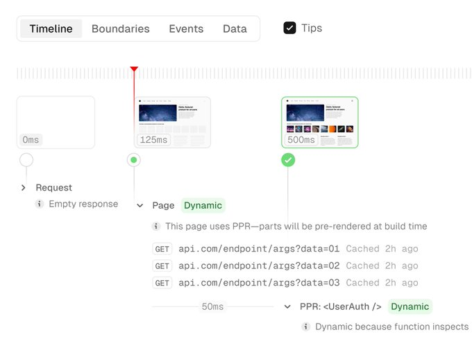

### 发布

- `ECharts v5.5`
  - 增强的 ESM 支持，默认解析为 ESM 包
  - 新增客户端轻量运行时，客户端无需加载完整 ECharts 即可实现部分交互，极大地提升页面加载速度
  - 新增 childGroupId 配置项，实现数据下钻的过渡动画功能
  - 新增 min-max 采样方式，可以在保留数据的整体趋势的同时，更加精确的展示数据的极值
  - Tooltip 可以通过 tooltip.appendTo 指定容器，更灵活地控制提示框的位置
- `Astro v4.4`
  - 添加开发工具栏的性能审核，可识别并修复 Astro 站点中的性能问题
  - 流媒体性能改进，ReadableStreams 在 Node.js 上比预期慢，因此在 Node.js 上运行时将 Astro 迁移为使用 AsyncIterable
  - 新的 inferSize 属性可以用来替代远程图像之前所需的宽度和高度属性，可推断远程图像尺寸
- `Remix v2.7`

  - 已稳定支持 Vite
  - 支持构建在生产中不需要 JavaScript 服务器的纯静态站点，同时保留 Remix 基于文件的路由约定、自动代码分割
  - 新增 basename 选项

    ```js
    import { vitePlugin as remix } from '@remix-run/dev'
    import { defineConfig } from 'vite'
    export default defineConfig({
      base: '/my-app/public/',
      plugins: [
        remix({
          basename: '/my-app'
        })
      ]
    })
    ```

  - Cloudflare Pages 支持

- `Vitest v1.3`
  - 弃用 watchExclude
  - 与 Jest 兼容新增 snapshotSerializers 配置选项
  - 新增 onTestFinished hook，测试执行到清理状态期间调用
  - 对 wasm 模块支持
- `Deno v1.41`，Linux ARM64 支持、deno 编译二进制文件带来了更轻量级的构建，使生成的二进制文件小了 50%

### 资讯

> React Labs 2024

`React Forget`现已更名为`React Compiler`，准备第一个开源版本。

由于 React 在重新渲染太多的问题，此前的解决方案是通过 useMemo、useCallback 和 memo API 来手动调整 React 在状态更改时重新渲染的程度。这种方案是一种妥协，会使得代码变得混乱，复杂。为能更好地解决此问题，实现当状态发生变化时，React 能够自动重新渲染 UI 的正确部分因而推出`React Compiler`。

React 19 会是下一个主要版本，在接下来的几个月将透露有关 React 19 包含的所有内容，如何采用新客户端功能以及如何构建对 React Server 组件的支持的更多信息。

> Warp 发布 Linux 版

此前 Warp 仅发布 macOS 版，近日宣布提供对 Linux 支持，现在可以下载适用于 Ubuntu、Fedora、Arch Linux 或 RedHat 等流行发行版的 Warp 终端。但 Windows 依旧未支持尚未发布，可以加入等候名单中。

与 macOS 版一样，Linux 版的 Warp 完全用 Rust 构建，所有图形渲染都直接在 GPU 上完成，速度很快，支持开箱即用的 zsh、bash 和 fish。

> Next.js Devtools

Next.js 开发者工具将带来视化预渲染、流、缓存等内容。



> LangSmith

近日`LangChain`完成了 2500w 美元 A 轮融资，并表示正在推出`LangSmith`，这是其首款全面上市的付费 LLMOps 产品，被设计为一个一体化平台，允许开发人员通过覆盖项目的整个生命周期（从开发和测试到部署和监控）来加速其 LLM 申请工作流程。推出此产品之际，开发人员需要解决方案来构建由语言模型支持的应用程序，以及高级可见性和工具，以确保在生产中具有高性能和可靠性。

> "Linux 中国" 开源社区，停止运营

今年 2 月起，"Linux 中国" 社区，包括它的主网（ https://linux.cn/ ）、公众号、视频号，以及下属的《硬核观察》栏目，将无限期停止更新和运营。

此社区创办于 2003 年，至今有 20 余年。根据作者描述，随着社区贡献者活跃度下降、经济压力的增加、个人疲惫等因素决定不再继续运营。

---

资料：

- https://echarts.apache.org/handbook/en/basics/release-note/5-5-0
- https://astro.build/blog/astro-440
- https://remix.run/blog/remix-vite-stable
- https://react.dev/blog/2024/02/15/react-labs-what-we-have-been-working-on-february-2024
- https://www.warp.dev/blog/warp-for-linux
- https://venturebeat.com/ai/langchain-lands-25m-round-launches-platform-to-support-entire-llm-application-lifecycle
