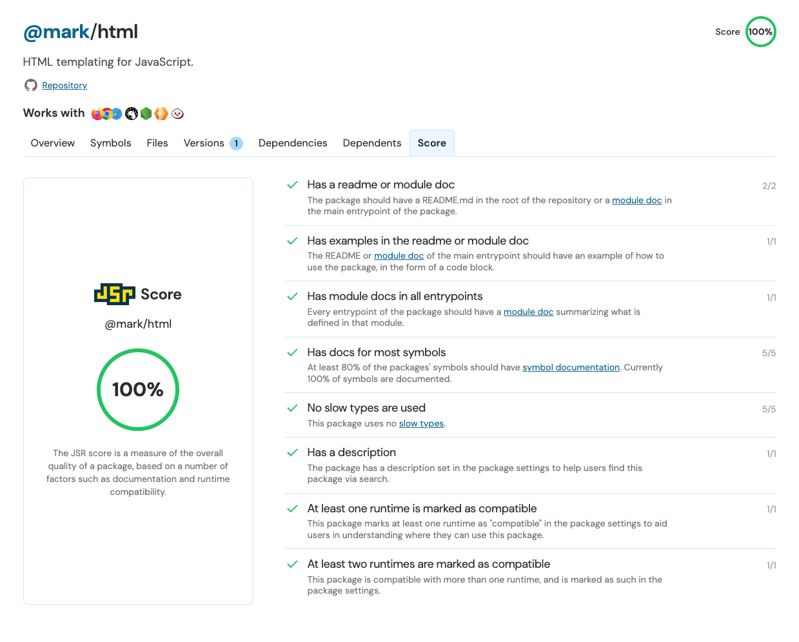

### 发布

- `Parcel v2.12`
  - 引入对宏的支持实现在构建时生成代码，生成常量、代码无需任何自定义插件
  - 新增 REPL，具有完整的代码编辑器、文件浏览器，并支持大多数 Parcel 功能，包括监视模式、开发服务器、热模块替换
  - 使用 Lightning CSS 打包 CSS 文件
  - 性能改进，内存使用量减少了约 52%，写入性能提高了约 5%
- `Babel v7.24`，匹配提案最新版更新了装饰器、增加了对浏览器和 Node.js 中导入 JSON 模块的支持
- `LightningCSS v1.24`，添加对 light-dark() 颜色函数的支持、解析支持 CSS system colors
- `Element Plus v2.6`，新增 Anchor 锚点组件

### 资讯

> JSR

Deno 推出`JSR`，一个现代 JavaScript 和 TypeScript 的开源包注册表，对 TypeScript 进行了优化，仅支持 ESM，目前还处于公开测试版。

发布 TypeScript 源代码，JSR 会生成 API 文档、`.d.ts`文件，并转译代码以实现跨运行时兼容性，支持的运行时有 `Node`、`Deno`、`Bun`、`Cloudflare Workers`等。可以与任何 JavaScript 包管理器一起使用，也可以在任何具有 node_modules 文件夹的项目中使用。

推出 JSR 基于以下因素：

1. ECMAScript 模块已成为标准，Web 平台现已采用 ESM 作为首选模块格式取代 CommonJS
2. 除了 Node.js 和浏览器之外，随着 Deno、Bun、workerd 和其他新 JavaScript 运行时的出现，有益于对于整个 JS 生态系统发展
3. 随着 TypeScript 发展愈发成熟，代注册表的设计应考虑到 TypeScript

安装和发布：

```sh
# deno
deno add @luca/flag

# npm (and npm-like systems)
npx jsr add @luca/flag
```

```sh
# with deno installed (https://docs.deno.com/runtime/manual)
deno publish

# with npm-like systems
npx jsr publish
```

还可以在包的详情页中查看评分，根据评分能了解到包质量，基于文档、运行时兼容性。



JSR 给我的感觉更像是 Deno 的包管理器。

> Vercel AI SDK 3.0

3 月 1 日 Vercel 推出支持生成式 UI 的 AI SDK 3.0，为 LLMs 提供丰富且基于组件的界面，带来全新的 AI 开发体验。

借助 AI SDK 3.0，现在可以将 LLM 响应与流式 React 服务器组件关联起来，无需大量的客户端 JavaScript 代码，使得应用程序更具交互性和响应性，而且不会影响性能。

新的 API 依赖于 Next.js 中实现的 React Server Components (RSC) 和 React Server Actions，如果想在其他框架中使用如 Remix，需要该框架实现 RSC。

> Node.js 吉祥物

Node.js 推出吉祥物：火箭龟。


> Rsbuild 1.0 发布计划

官方团队计划在今年 7 月前发布`Rsbuild v1.0`（基于 Rspack v1.0），发布 v1.0 之前实现的架构更改和关键功能如下：

- 库构建模式
- 原生 CSS 提取
- 更加更定的 API
- 完成对所有包的`ESM`支持
- `PWA`、`Web Worker`、`Lightning CSS`支持
- 插件系统
- 实现错误叠加，提高开发体验
- 性能上进一步优化

> Stack Overflow 引入 AI

Stack Overflow 与 Google Cloud 宣布合作为开发者带来生成式 AI。Google Cloud 将把 Gemini for Google Cloud 与 Stack Overflow 集成用以辅助开发者。Stack Overflow 计划利用 Google Cloud 最先进的 AI 功能来改善其社区参与体验和内容管理流程。

> Bun for Windows

在 Bun v1.0.25 版本中表明 Windows 版将于 2 月初发布，但出于某些缘故往后推延了，发布日期尚未明确。Bun for Windows 目前最新状态是通过了测试套件的 89.11%。


---

资料：

- <https://github.com/element-plus/element-plus/releases/tag/2.6.0>
- <https://parceljs.org/blog/v2-12-0>
- <https://babeljs.io/blog/2024/02/28/7.24.0>

- <https://deno.com/blog/jsr_open_beta>
- <https://github.com/web-infra-dev/rsbuild/discussions/1678>
- <https://vercel.com/blog/ai-sdk-3-generative-ui>
- <https://stackoverflow.co/company/press/archive/google-cloud-strategic-gen-ai-partnership>
