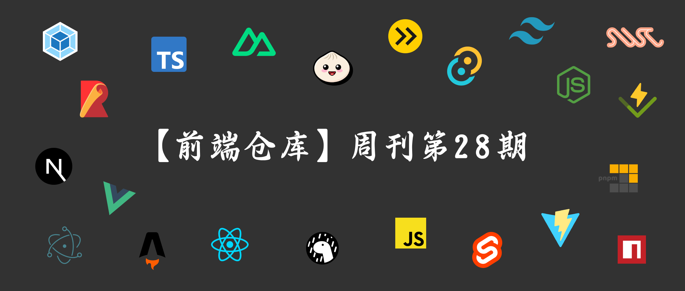
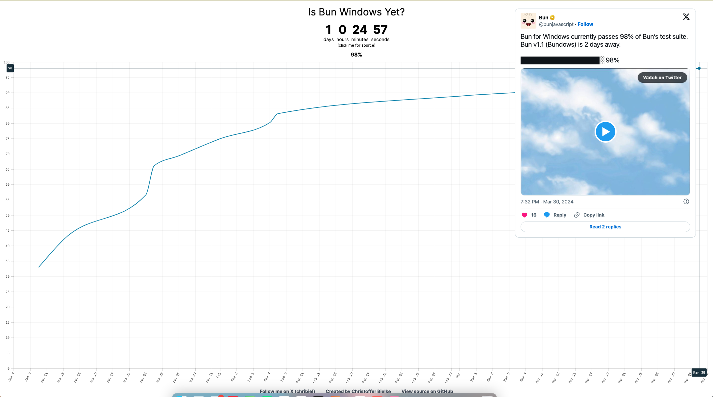
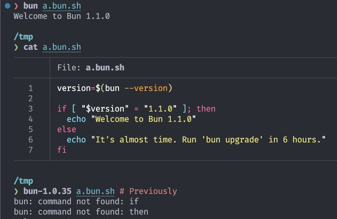
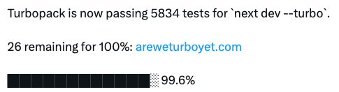

### 发布

- `Vite v5.2`，
  - SSR 中的 import.meta.filename/dirname 支持
  - 升级 esbuild 到 v0.20
  - 文档代码片段添加 shiki、twoslash 支持
- `Deno v1.42`，
  - 添加对 JSR 的一等支持，可直接使用 deno publish 和 deno add 发布和安装包
  - 大幅提升与 Node.js 和 NPM 兼容性
  - 跨平台 shebang 支持，只要是以 #!/usr/bin/env -S 开头
  - 添加对 jsr: 说明符支持以及名称和版本补全
  - 更快的启动速度，在 Linux 上启动时间缩短 10%
- `Ant Design v5.16`，新增 Input.OTP（one-time password）组件

### 资讯

> Bundows

`Bun for Windows`经过一次“跳票”后（原本计划 2 月初发布）终于有了明确发布日期，将于 4 月 2 日 v1.1 版本中发布。

马上可以在 Windows 上完美使用 Bun，进度可以去到[这](https://isbunwindowsyet.com/)查看。

> Bun Shell

在下个版本，也就是 v1.1 中，Bun Shell($)获得 if 语句支持。

> GraphQLConf 回归

于 3 月 28 日 GraphQL 宣布 GraphQLConf 回归，并于 9 月份（还有 5 个月等待）在旧金山举行。

> Baidu Comate 2.0

百度推出的智能代码助手，基于文心大模型，结合百度积累多年的编程现场大数据和外部优秀开源数据，生成更符合实际研发场景的优质代码。跟其他代码助手一样，有代码生成、代码解释、技术问答等功能。

推出的 2.0 版本能力全面增强，向个人开发者免费开发使用，感兴趣同学可在 vscode 中安装`Baidu Comate`插件体验。

> Turbopack

Turbopack 现已通过`next dev --turbo`的 5834 项测试，进度达到 99.6%，距离 100% 剩余 26 个。

---

资料：

- <https://deno.com/blog/v1.42>
- <https://graphql.org/blog/2024-03-28-announcing-graphqlconf-2024>
- <https://comate.baidu.com>
